# Manual de Usuario - PescApp

## Índice
1. [Introducción](#introducción)
2. [Acceso al Sistema](#acceso-al-sistema)
3. [Página de Inicio](#página-de-inicio)
4. [Mapa de Coordenadas](#mapa-de-coordenadas)
5. [Análisis Estadístico](#análisis-estadístico)
6. [Información Meteorológica](#información-meteorológica)
7. [Gestión de Usuarios](#gestión-de-usuarios)
8. [Perfil de Usuario](#perfil-de-usuario)
9. [Configuración](#configuración)
10. [Visualizador de Datos](#visualizador-de-datos)

## Introducción

PescApp es una aplicación web desarrollada para rastrear y visualizar viajes de pesca, promover la trazabilidad pesquera y proporcionar información valiosa para la toma de decisiones. Esta aplicación es un proyecto académico desarrollado por investigadores de ECOSUR y de la UABC con financiamiento de CCyTET.

La aplicación está diseñada para ser intuitiva y fácil de usar, permitiendo a los usuarios:
- Registrar y monitorear viajes de pesca en tiempo real
- Analizar patrones de pesca y movimiento
- Acceder a información meteorológica relevante
- Gestionar perfiles de usuario y configuraciones
- Visualizar datos estadísticos para la toma de decisiones

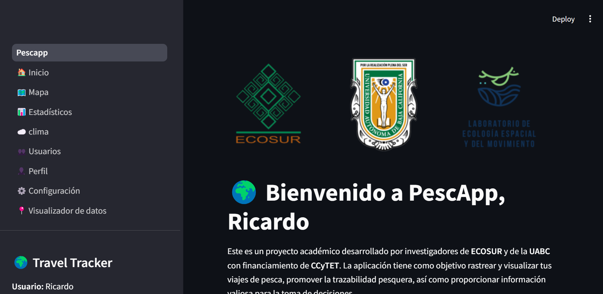
*Figura 1: Pantalla principal de PescApp*

## Acceso al Sistema

### Inicio de Sesión
Para acceder a PescApp, necesita contar con credenciales válidas (correo electrónico y contraseña).

1. Ingrese su correo electrónico
2. Ingrese su contraseña
3. Haga clic en "Iniciar Sesión"

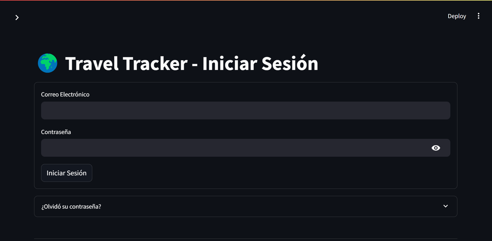
*Figura 2: Pantalla de inicio de sesión*

### Tipos de Usuarios y Permisos
La aplicación maneja diferentes niveles de acceso:
1. **Administrador**: Acceso total al sistema
2. **Monitor**: Puede gestionar viajes y ver estadísticas
3. **Usuario**: Acceso básico a sus propios datos
4. **Visitante**: Solo puede ver información pública

## Página de Inicio

La página de inicio sirve como centro de control principal, proporcionando una vista general del sistema.

### Elementos principales:
#### 1. Métricas Generales
- **Total de viajes**: Contador de viajes registrados en el sistema
- **Distancia total**: Suma de las distancias recorridas en kilómetros
- **Nivel de acceso**: Muestra el rol actual del usuario
- **Estadísticas rápidas**: Promedio de duración de viajes y velocidad

#### 2. Panel de Actividad Reciente
- Últimos 5 viajes registrados con detalles como:
  - Fecha y hora
  - Duración
  - Distancia recorrida
  - Estado del viaje

#### 3. Accesos Rápidos
- Botones de acceso directo a las funciones más utilizadas
- Notificaciones importantes
- Estado del sistema

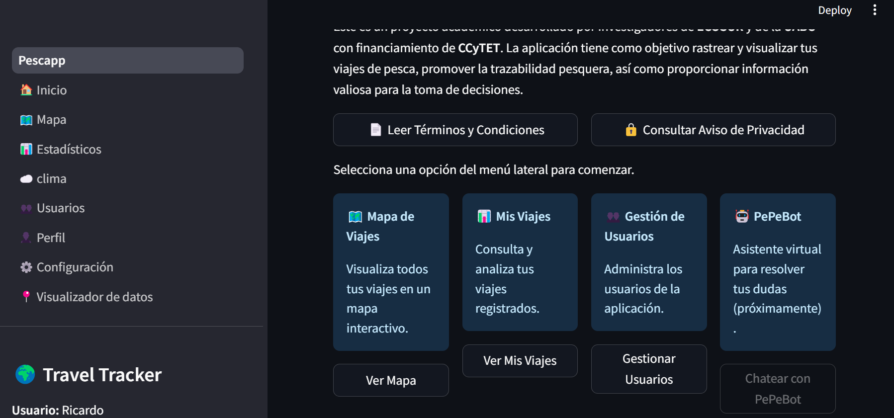
*Figura 3: Dashboard principal con métricas y accesos rápidos*

## Mapa de Coordenadas

El mapa de coordenadas es una herramienta fundamental para la visualización y análisis de datos geográficos.

### Funcionalidades Detalladas:

#### 1. Visualización de Datos
- **Capas del Mapa**:
  - Vista de satélite
  - Vista de calles
  - Vista híbrida
  - Capa de profundidad marina (batimetría)

#### 2. Filtros Avanzados
- **Por Usuario**: 
  - Filtrado individual o múltiple
  - Búsqueda por nombre o ID
- **Por Fecha**:
  - Rango de fechas personalizado
  - Filtros predefinidos (última semana, mes, año)
- **Por Tipo de Viaje**:
  - Pesca comercial
  - Monitoreo
  - Investigación
  - Otros

#### 3. Herramientas de Análisis
- **Medición de Distancias**: 
  - Entre puntos específicos
  - Total del recorrido
- **Análisis de Velocidad**:
  - Velocidad promedio
  - Velocidad máxima
  - Puntos de parada
- **Densidad de Puntos**:
  - Mapa de calor de actividad
  - Zonas frecuentes

#### 4. Exportación de Datos
- **Formatos Disponibles**:
  - CSV para análisis en Excel
  - GeoJSON para sistemas GIS
  - KML para Google Earth
- **Opciones de Exportación**:
  - Datos completos
  - Datos filtrados
  - Selección manual de campos

### Interpretación de Datos en el Mapa:
- **Puntos de Color**:
  - Verde: Inicio de viaje
  - Rojo: Fin de viaje
  - Amarillo: Puntos de interés
  - Azul: Puntos de ruta normales
  
- **Líneas de Trayecto**:
  - Grosor indica velocidad
  - Color indica tipo de actividad
  - Patrón de línea indica estado del viaje

- **Información al Hacer Clic**:
  - Coordenadas exactas
  - Hora del registro
  - Velocidad en el punto
  - Profundidad (si está disponible)
  - Notas asociadas

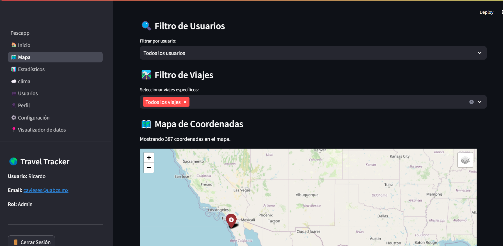
*Figura 4: Visualización de coordenadas en mapa interactivo*

### Pasos para visualizar datos:
1. Haga clic en "Cargar Datos"
2. Seleccione el usuario (si tiene permisos)
3. Seleccione los viajes específicos (opcional)
4. Explore el mapa interactivo

## Análisis Estadístico

La sección de análisis estadístico proporciona herramientas avanzadas para el análisis de datos.

### Tipos de Análisis Disponibles:

#### 1. Análisis Temporal
- **Patrones Diarios**:
  - Horas pico de actividad
  - Duración promedio por hora del día
  - Distribución de inicios de viaje
- **Patrones Semanales**:
  - Días más activos
  - Comparativa entre días laborables y fines de semana
- **Análisis Mensual y Estacional**:
  - Tendencias por mes
  - Comparativa entre estaciones
  - Identificación de temporadas altas/bajas

#### 2. Análisis Espacial
- **Zonas de Actividad**:
  - Áreas más frecuentadas
  - Distancia desde puerto
  - Profundidad promedio
- **Rutas Comunes**:
  - Identificación de patrones de ruta
  - Optimización de recorridos
  - Áreas de concentración

#### 3. Análisis de Rendimiento
- **Métricas de Viaje**:
  - Velocidad promedio/máxima
  - Consumo estimado de combustible
  - Eficiencia de rutas
- **Comparativas**:
  - Entre embarcaciones
  - Entre temporadas
  - Entre tipos de viaje

### Interpretación de Gráficos:

#### 1. Gráficos de Barras
- **Eje X**: Variable independiente (tiempo, categoría)
- **Eje Y**: Medida (cantidad, distancia, velocidad)
- **Color**: Diferenciación de categorías
- **Altura**: Magnitud del valor

#### 2. Gráficos de Línea
- **Tendencias temporales**
- **Patrones cíclicos**
- **Variaciones estacionales**
- **Predicciones y proyecciones**

#### 3. Mapas de Calor
- **Intensidad de color**: Nivel de actividad
- **Agrupación**: Concentración de eventos
- **Patrones espaciales**: Distribución geográfica

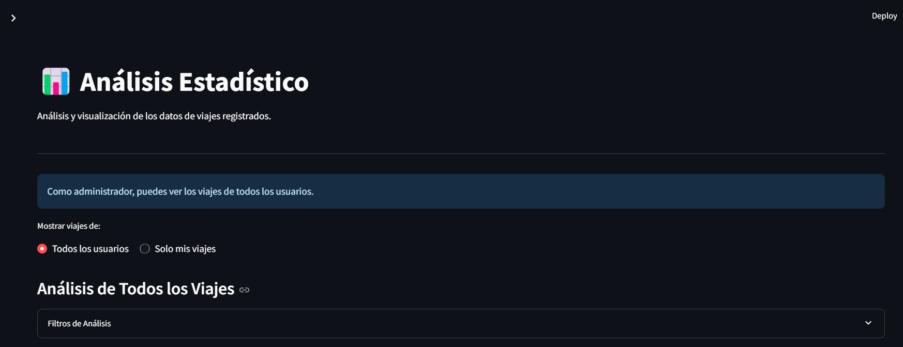
*Figura 5: Panel de análisis estadístico*

### Tipos de visualizaciones:
1. **Distribución por Tipo**
   - Gráfico circular de tipos de viaje
   
   *Figura 6: Distribución de viajes por tipo*

2. **Actividad Temporal**
   - Viajes por día
   - Distribución por hora
   - Distribución por día de la semana
   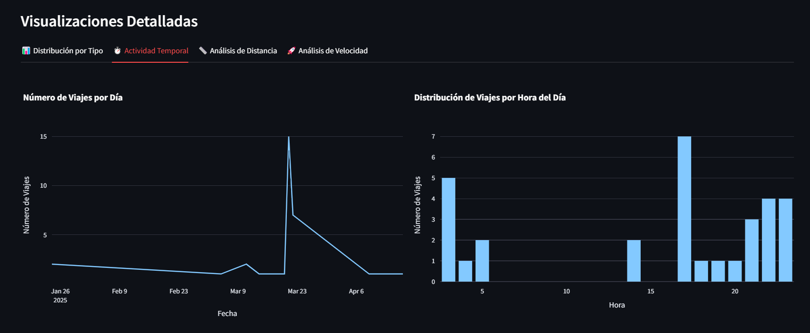
   *Figura 7: Análisis de actividad temporal*

## Información Meteorológica

La sección de meteorología proporciona datos críticos para la planificación de actividades pesqueras.

### Datos Disponibles:

#### 1. Condiciones Actuales
- **Temperatura**: 
  - Aire y agua superficial
  - Tendencia en las últimas 24 horas
- **Viento**:
  - Velocidad y dirección
  - Ráfagas
  - Rosa de los vientos

- **Presión Atmosférica**:
  - Valor actual
  - Tendencia

#### 3. Mareas
- **Tabla de Mareas**:
  - Pleamar y bajamar
  - Altura en metros
  - Horarios exactos
- **Corrientes**:
  - Dirección
  - Velocidad
  - Variación temporal

### Interpretación de Datos:

#### 1. Indicadores de Riesgo
- **Verde**: Condiciones óptimas
- **Amarillo**: Precaución
- **Rojo**: Condiciones peligrosas

#### 2. Gráficos de Tendencia
- Evolución temporal de parámetros
- Predicción de cambios
- Patrones históricos

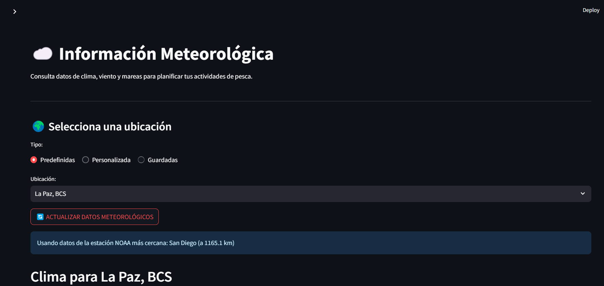
*Figura 8: Panel de información meteorológica*

## Gestión de Usuarios

*Disponible solo para administradores*

### Niveles de Acceso y Permisos

#### 1. Administrador
- Gestión completa de usuarios
- Asignación de roles
- Configuración del sistema
- Acceso a todos los datos

#### 2. Monitor
- Seguimiento de usuarios asignados
- Validación de datos
- Reportes específicos
- Gestión limitada

#### 3. Usuario Regular
- Gestión de perfil propio
- Registro de viajes
- Visualización de datos personales

### Funciones de Administración

#### 1. Gestión de Cuentas
- Creación de usuarios
- Modificación de perfiles
- Desactivación temporal
- Eliminación de cuentas

#### 2. Asignación de Roles
- Definición de permisos
- Grupos de trabajo
- Jerarquías de acceso

#### 3. Monitoreo de Actividad
- Registro de accesos
- Auditoría de cambios
- Reportes de uso

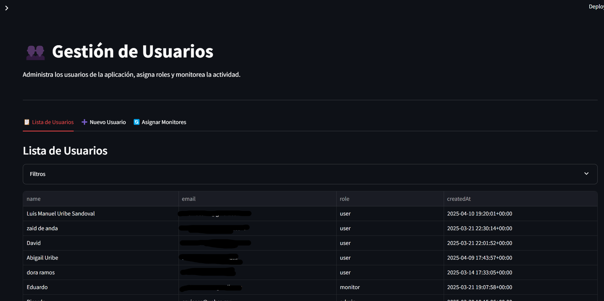
*Figura 9: Panel de gestión de usuarios*

## Perfil de Usuario

Permite gestionar la información personal y preferencias del usuario.

### Información Personal
- Datos básicos
- Credenciales
- Preferencias
- Historial

### Configuraciones
- Notificaciones
- Visualización
- Privacidad
- Accesibilidad

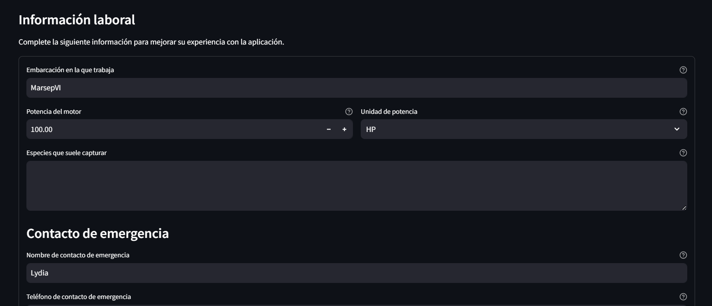
*Figura 10: Formulario de perfil de usuario*

## Configuración

Permite personalizar la experiencia de usuario en la aplicación.

### Opciones disponibles:
- Perfil de usuario
- Preferencias de visualización
- Opciones del mapa
- Privacidad
- Cambio de contraseña

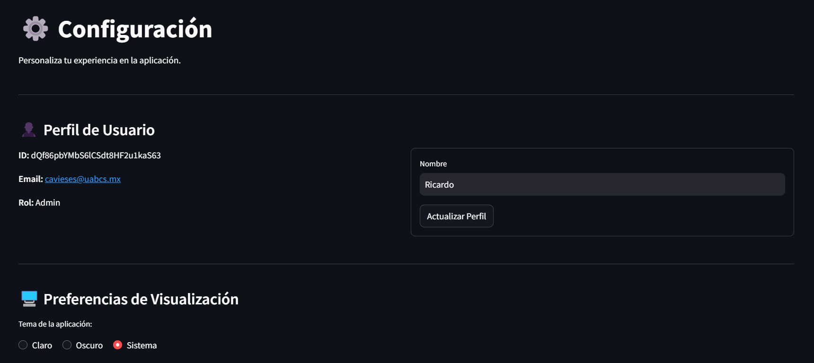
*Figura 11: Panel de configuración*

## Visualizador de Datos

Permite consultar y analizar los datos almacenados en el sistema.

### Tipos de Visualización
- Tablas dinámicas
- Gráficos interactivos
- Mapas temáticos
- Reportes personalizados

### Herramientas de Análisis
- Filtros avanzados
- Agrupaciones
- Cálculos automáticos
- Exportación personalizada

### Interpretación
- Guías contextuales
- Indicadores clave
- Comparativas
- Tendencias y proyecciones

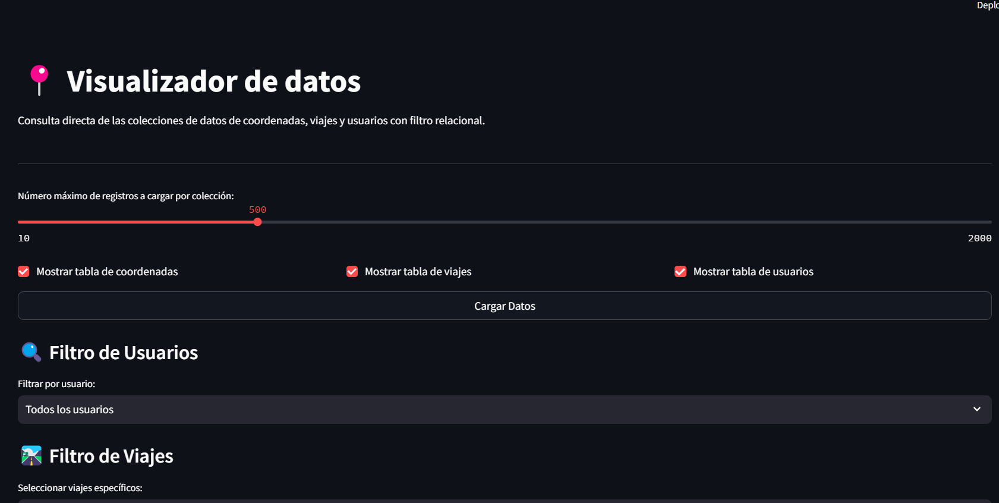
*Figura 12: Visualizador de datos con tablas y filtros*

## Soporte Técnico

Para obtener ayuda o reportar problemas:
- Email: cavieses@uabcs.mx

---

**Nota**: Esta aplicación es un proyecto académico desarrollado con fines de investigación y demostración. No debe considerarse como una herramienta de seguridad o sistema de auxilio en tiempo real.

© 2025 PescApp - Todos los derechos reservados